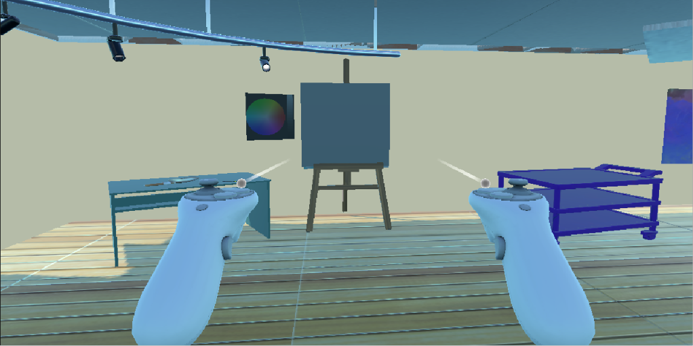
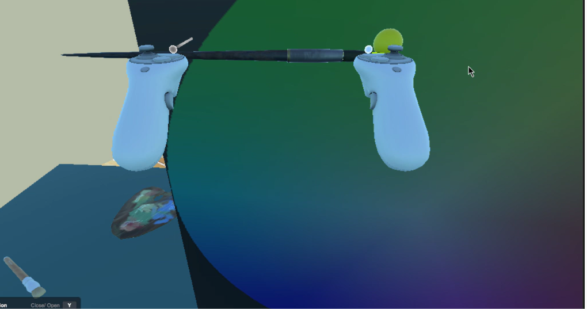
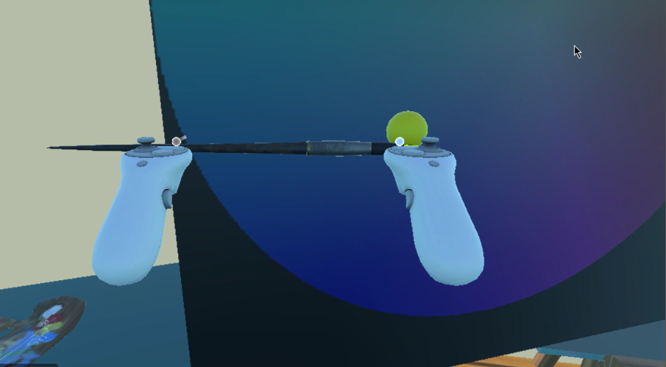
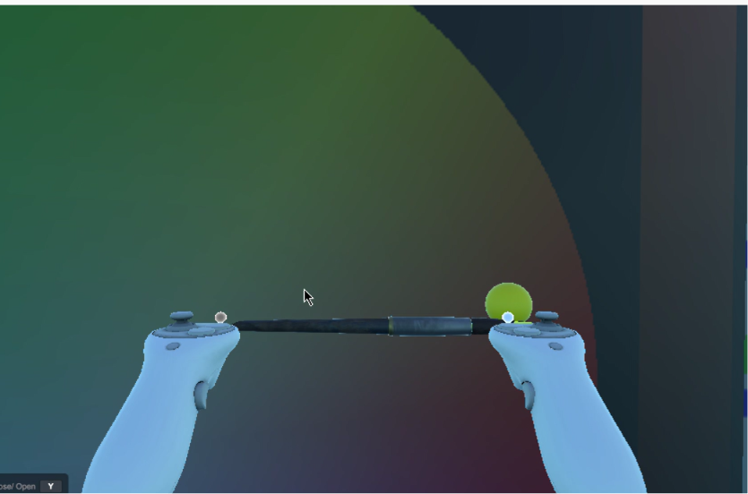
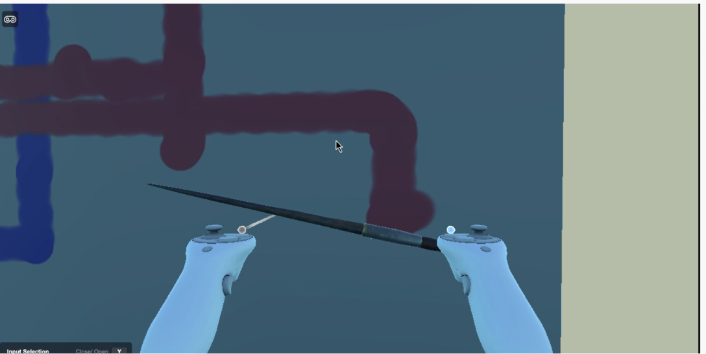

# VR Painting Room

Une expérience de peinture en réalité virtuelle où l’utilisateur peut peindre sur un tableau interactif avec un pinceau virtuel, changer de couleur et explorer un environnement immersif.

## Présentation

Ce projet a été conçu comme une application VR avec interaction manuelle, permettant de :

- peindre sur un canvas en 3D,
- choisir des couleurs depuis une palette interactive,
- manipuler un pinceau virtuel dans l’espace,

## Fonctionnalités principales

- Pinceau interactif avec raycast et détection de surface
- Canvas dynamique avec texture de dessin modifiable
- Palette de couleurs avec sélection tactile/visuelle

## Démo animée

Voici une version GIF de la démonstration du projet :

## Captures du projet

  
  
  
  
  
  
  
  

## Démo vidéo

Une vidéo de démonstration est disponible ici :

- [Vidéo de démonstration](Assets/screeshots/painting.mp4)

## Prérequis

- Unity 2022 LTS ou version compatible
- XR Interaction Toolkit
- Un casque VR compatible pour l’expérience complète

## Lancer le projet

1. Ouvrir le projet dans Unity
2. Charger la scène principale depuis Assets/Scenes
3. Lancer la scène en mode Play
4. Utiliser le pinceau virtuel pour dessiner
